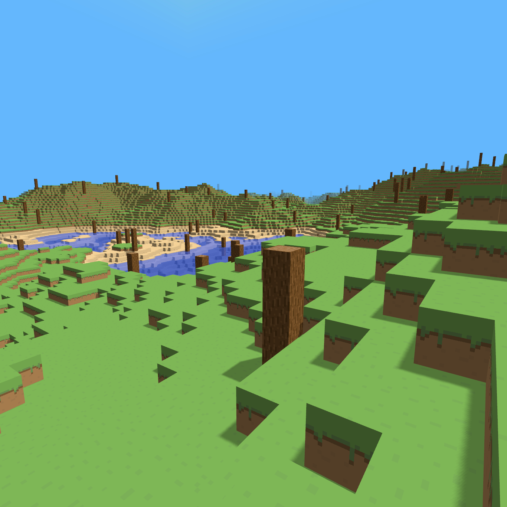

# Minecraft in C with OpenGL
An attempted clone of minecraft, making an infinite voxel engine completely in C with only necessary utility libraries for window creation, input and output.
#

#
## Main Features:
- Infinite world generation.
- Seeded terrain generation.
- High-performance indexed rendering.
- Chunk sorting.
#
This project is mainly an exercise, I am attempting to implement everything myself as I am able:
- Hashmap, Hashset, Linked List, Array List.
- Linear algebra.
- Dynamic mesh generation, backface culling.
- Chunk sorting, transparency sorting.
- Input library wrapper.
- Camera matrix generation. 
- Custom parser and files for block/face data.
#
The code adequately frees all memory without a necessary heap dump at program termination. The goal is to have this properly running on Linux and Windows. I may port this to vulkan in the future.
